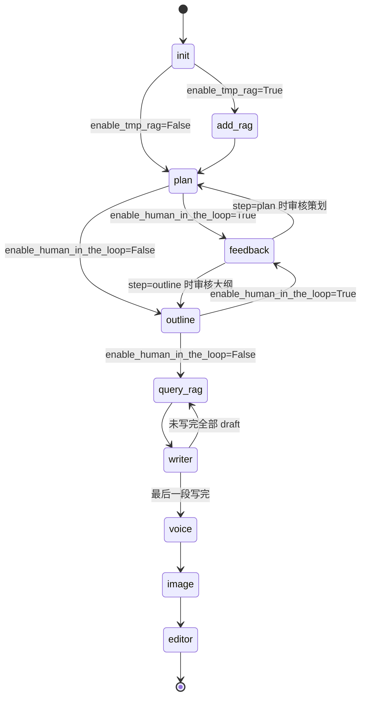

# API Reference v2.1

> tldr：该版本主要在2.0的基础上引入了RAG，并据此修改了内容生成管线

## 1. 项目定位与版本变化

- 项目：基于 LangGraph 的自动化哲学短视频生成系统。
- v2.1 关键变化：在内容层引入临时 RAG（Chroma + m3e-base）并把写作阶段改造成 `query_rag -> writer` 循环。
- 仍保留 v2.0 的分层思路：内容层、视图层、服务层、配置层。

## 2. 启动逻辑

入口：`src/app.py`

1. `asyncio.run(app())` 启动。
2. `create_search_pipeline()` 构建 `StateGraph(VideoState)`，注册节点：
   - `init`
   - `add_rag`
   - `plan`
   - `outline`
   - `query_rag`
   - `writer`
   - `feedback`
   - `voice`（带 `RetryPolicy(max_attempts=3, initial_interval=1.0)`）
   - `image`
   - `editor`
3. 仅静态边：`START -> init`，其余全部通过各节点返回 `Command(goto=...)` 动态跳转。
4. Checkpointer：`InMemorySaver()`。
5. `app()` 中创建 `VideoStateConfig`（默认：`enable_tmp_rag=True`、`image_mode="static"`、人类在环关闭），读取 `core_topic`，组装初始状态后以 `astream` 流式执行并打印各节点 AI 输出。

## 3. 状态图设计



## 4. 全局状态与数据结构

定义位置：`src/config.py`

### 4.1 `VideoStateConfig`

```json
{
  "max_attempts": "int | None",
  "enable_ai_reflection": "bool | None",
  "enable_human_in_the_loop": "bool",
  "image_mode": "generate | static",
  "enable_tmp_rag": "bool"
}
```

### 4.2 业务结构

- `Proposal`
  - `title: str`
  - `topic: str`
  - `video_plan_length: float`
  - `special_requirements: str`
- `DraftItem`
  - `section_id: int | None`
  - `section_description: str | None`
  - `section_script: str | None`
- `Feedback`
  - `status: str`
  - `attempt: int`
- `VoiceItem`
  - `voice_local_path: str`
  - `srt_local_path: str`
  - `voice_length: float`
- `imageItem`
  - `scene_id: int`
  - `start_time: str`
  - `end_time: str`
  - `img_local_path: str | None`
  - `prompt: str | None`
  - `img_name: str | None`
  - `img_url: str | None`

### 4.3 `VideoState` 关键字段

- `messages`：节点消息聚合（`add_messages`）。
- `step`：当前阶段标记。
- `timings`：各节点耗时聚合（`operator.ior`）。
- `video_state_config`：运行配置。
- `feedback`：反馈结果。
- `core_topic`：用户输入核心主题。
- `proposal`：策划输出。
- `draft`：大纲/分段文案容器。
- `current_draft_id`：当前写作段落索引。
- `rag_query_results`：当前段的 RAG 参考文本列表。
- `script`：累计完整脚本。
- `voice`：配音输出。
- `images`：配图输出。
- `video_file_path`：最终视频路径。

## 5. 节点接口（输入/输出/路由）

### 5.1 `init_node`（`src/content/init.py`）

- 输入：`video_state_config.enable_tmp_rag`
- 输出更新：
  - `messages`
  - `step = "init"`
- 路由：
  - `enable_tmp_rag=True -> add_rag`
  - `enable_tmp_rag=False -> plan`

### 5.2 `add_rag_node`（`src/content/add_rag.py`）

- 输入：
  - 固定文档路径：`resources/documents/static/zhaolin_xifangzhexueshijiangyanlu.txt`
  - RAG 服务组件（懒加载）
- 处理：
  - `TextLoader` 读取
  - `RecursiveCharacterTextSplitter` 切块
  - 每块用 `md5(page_content)` 生成去重 ID
  - 每块写入 `importance_score`
  - 入库 Chroma
- 输出更新：
  - `messages`
  - `step = "init"`
  - `timings`
- 路由：`plan`

### 5.3 `plan_node`（`src/content/plan.py`）

- 输入：
  - `step`（`init` 或 `plan_feedback`）
  - `core_topic`
  - `feedback`
  - `video_state_config.enable_human_in_the_loop`
- 处理：
  - LLM 生成 JSON 策划案并 `json.loads`
  - 写入 `proposal`
- 输出更新：
  - `messages`
  - `step = "plan"`
  - `timings.plan_node`
  - `proposal`
- 路由：
  - 人类在环关闭：`outline`
  - 人类在环开启：`feedback`

### 5.4 `feedback_node`（`src/content/feedback.py`）

- 输入：`step`（仅支持 `plan` / `outline`）
- 处理：终端 `input()` 获取人工审核（接受或拒绝 + 修改意见）
- 输出更新：
  - `messages`
  - `feedback`
  - `step = "plan_feedback"` 或 `"outline_feedback"`
- 路由：
  - `plan` 审核后回 `plan`
  - `outline` 审核后回 `outline`

### 5.5 `outline_node`（`src/content/outline.py`）

- 输入：
  - `step`（`plan` 或 `outline_feedback`）
  - `proposal`
  - `feedback`
  - `video_state_config.enable_human_in_the_loop`
- 处理：
  - `with_structured_output(OutlineOutputModel)` 生成 `drafts`
  - `section_script` 置空
  - 初始化 `current_draft_id=0`、`script=""`
- 输出更新：
  - `messages`
  - `step = "outline"`
  - `timings.outline_node`
  - `draft`
  - `current_draft_id`
  - `script`
- 路由：
  - 人类在环关闭：`query_rag`
  - 人类在环开启：`feedback`

### 5.6 `query_rag_node`（`src/content/query_rag.py`）

- 输入：
  - `video_state_config.enable_tmp_rag`
  - `current_draft_id`
  - `draft[current_draft_id].section_description`
- 处理：
  - 若关闭 RAG：直接返回占位参考
  - 若开启 RAG：
    - 构造查询：原始 query + QME(3条) + HyDE(1段)
    - 多次 `similarity_search_with_relevance_scores`
    - 去重（按 doc.id 保留最高相关度）
    - 综合排序：`0.7*importance_score + 0.3*relevance`
    - 截取 top-k 并过滤低相关度
- 输出更新：
  - `messages`
  - `step = "writer"`
  - `timings.writer_node`
  - `rag_query_results: list[str]`
- 路由：`writer`

### 5.7 `writer_node`（`src/content/writer.py`）

- 输入：
  - `current_draft_id`
  - `draft`
  - `script`
  - `rag_query_results`
- 处理：
  - 针对当前段生成正文
  - 回填 `draft[current_draft_id].section_script`
  - 追加到 `script`
- 输出更新：
  - `messages`
  - `step = "writer"`
  - `timings.writer_node`
  - `draft`
  - `current_draft_id += 1`
  - `script`
- 路由：
  - 若当前段是最后一段：`voice`
  - 否则：`query_rag`

### 5.8 `voice_node`（`src/view/voice.py`）

- 输入：`script`
- 处理：`script_to_voice_generation_gpt_sovits(script)`
  - `parse_llm`：语义切句 + 角色映射
  - `AudioGenerationNode`：逐句调用 GPT-SoVITS API 生成音频并累计时间轴
  - `ExportNode`：导出 MP3/SRT（文件名 UUID）
- 输出更新：
  - `messages`
  - `step = "voice"`
  - `voice`
  - `timings.voice_node`
- 路由：`image`

### 5.9 `image_node`（`src/view/image.py`）

- 输入：
  - `video_state_config.image_mode`
  - `voice.srt_local_path`
- 处理：
  - `generate`：SRT 场景切分 + Qwen Image 生图 + 下载本地
  - `static`：固定使用 `resources/images/static/srnf.jpg`
- 输出更新：
  - `messages`
  - `step = "image"`
  - `images`
  - `timings.image_node`
- 路由：`editor`

### 5.10 `editor_node`（`src/view/editor.py`）

- 输入：
  - `voice.voice_local_path`
  - `voice.srt_local_path`
  - `images`
  - `proposal.title`
- 处理：
  - `moviepy` 合成图轨、字幕轨、音轨
  - 输出 `resources/videos/output/{title}.mp4`
- 输出更新：
  - `messages`
  - `step = "editor"`
  - `timings.editor_node`
  - `video_file_path`
- 路由：`END`

## 6. RAG 服务实现（v2.1 核心）

实现位置：`src/services/rag_service.py`

- 采用全局懒加载 `_RAG_COMPONENTS`，避免将复杂对象放入 LangGraph checkpoint。
- 组件：
  - `text_splitter = RecursiveCharacterTextSplitter(chunk_size=800, chunk_overlap=100)`
  - `embeddings = HuggingFaceEmbeddings(model_name="moka-ai/m3e-base")`
  - `vectorstore = Chroma(persist_directory='./chroma_db', collection_metadata={"hnsw:space": "cosine"})`
- 对外函数：`get_rag_components()`。

## 7. 模块分层速记

- 配置层：`src/config.py`
  - 路径常量、LLM、状态类型定义。
- 内容层：`src/content/*.py`
  - `init` 路由、`add_rag` 入库、`plan/outline/writer` 内容生成、`query_rag` 检索增强、`feedback` 人审回路。
- 服务层：`src/services/*.py`
  - `rag_service.py`（RAG 组件生命周期）
  - `start_sovits.py`（启动本地 GPT-SoVITS API）
- 视图层：`src/view/*.py`
  - `voice`（配音+字幕）
  - `image`（配图）
  - `editor`（视频合成）

## 8. 端到端代码逻辑（执行顺序）

1. 用户输入 `core_topic`。
2. `init` 路由到 `add_rag`（可选）或 `plan`。
3. `plan` 生成 `proposal`，可经 `feedback` 反复修订。
4. `outline` 生成 `draft`，可经 `feedback` 反复修订。
5. 进入循环：`query_rag -> writer`，直到所有 `draft` 段落写完并汇总 `script`。
6. `voice` 生成 MP3 + SRT。
7. `image` 生成或选取场景图。
8. `editor` 合成 MP4，输出 `video_file_path`，流程结束。