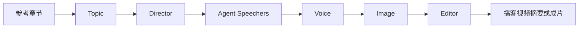

# 工程概览

## 作业定位

建议选择题目 E：工程实践与设计。这个项目适合写成“基于 LangGraph 的多阶段播客生成 agent 工作流整理与设计”，重点说明如何把一个早期实验项目改造成可复现、可调试、可验收的工程。

## 主线流程

各阶段职责：

- Topic：把参考章节拆成若干递进的粗课题。
- Director：为每个粗课题设计对话推进结构。
- Agent Speechers：模拟两个主持人生成双人播客脚本。
- Voice：把脚本转换为配音和字幕信息；demo 使用 mock。
- Image：根据字幕或时间轴生成画面计划；demo 使用 mock。
- Editor：合成视频或生成视频摘要；demo 使用 mock。

## 工程整理亮点

- 新增 `src/cli.py`，把运行方式从硬编码入口改为可配置命令行。
- 新增 `src/runtime/`，集中管理运行配置、健康检查、fixture、产物和 runner。
- 新增 `demo` 模式，默认不依赖 API key、TTS 服务、生图服务或 FFmpeg。
- 新增 `stage` 模式，可以基于同一个 session 单独重跑后处理阶段。
- 新增 `manifest.json` 和 `artifacts/`，每次运行都有阶段状态和配置快照。
- 新增 pytest 测试，覆盖配置解析、产物读写、健康检查、fixture、RAG 结果排序、脚本切分、FFmpeg 命令构造和主图形状。

## AI 使用说明

项目中的 Topic、Director、Agent Speechers、Voice 和 Image 阶段都可以接入 AI 生成能力。课程报告中应说明：demo 产物为 fixture/mock，用于工程展示；full 模式才会调用真实 LLM 或外部生成服务。报告撰写时如使用 AI 辅助总结代码、润色文字或生成图示，也应在报告中单独声明。

## 已知限制

项目暂时没有前端；full 模式依赖真实 API key 和本地媒体服务；旧 v1/v2.1 管线仍保留在仓库中，但不作为当前课程展示主线。部分历史文件存在编码遗留问题，后续若要继续发展项目，应优先重写旧 prompt 和前端交互层。
