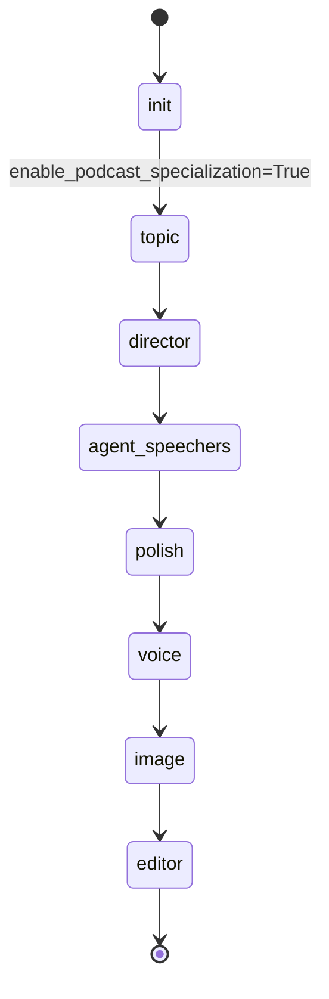
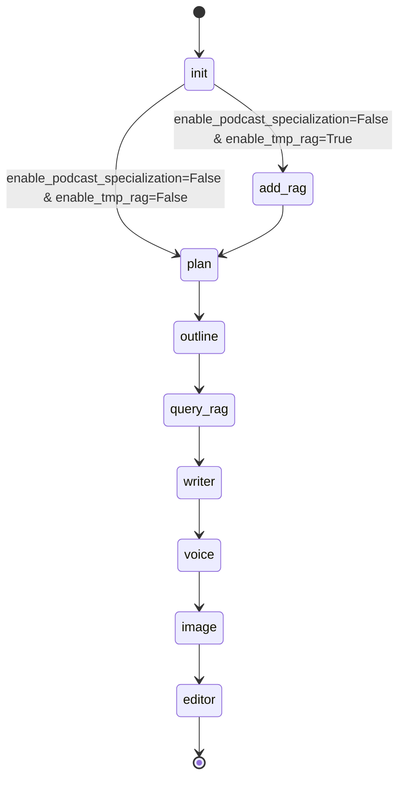

# API Reference v3.0

> tldr：v3.0 在 v2.1 通用管线基础上，新增播客特化管线层。通过 **topic → director → agent_speechers** 三阶段，将参考章节自动拆解为层级递进的粗课题、多人对谈编导方案、最终生成对谈播客脚本。保持 v2.1 的 RAG + 内容分层思路。

| 章节         | 内容                                                         |
| ------------ | ------------------------------------------------------------ |
| **整体架构** | 状态图（v3.0 播客+v2.1 通用两条路线）、启动逻辑、流程图      |
| **状态设计** | 新增 v3.0 数据结构（TopicItem、BulletItem、StageItem、ExtendTopicItem）、完整 VideoState 字段 |
| **节点设计** | 5 个新增/修改节点的完整 I/O 接口、处理逻辑、路由规则         |
| **核心逻辑** | 三阶段递进原理、代码执行顺序、Prompt 层次设计、JSON 解析     |
| **代码细节** | RAG 服务、Topic 拆解、Director 编导、Agent 对谈、Polish 润色的具体实现 |
| **速查表**   | 模块分层、v2.1/v3.0 差异对比、约束假设                       |

## 1. 项目定位与版本变化

- 项目：基于 LangGraph 的自动化哲学短视频生成系统
- v3.0 关键变化：
  - 基于 v2.1 的 RAG 能力和内容层管线
  - **新增播客特化内容生成层**：针对教育类对谈播客，设计了三段式管线
  - 保留 v2.1 的通用管线（plan → outline → query_rag → writer），通过配置标志位切换
  - 新增 polish 节点进行脚本润色
- 分层仍保留：配置层、内容层（通用 + 播客特化）、服务层、视图层

## 2. 启动逻辑

入口：`src/app.py`

1. `asyncio.run(app())` 启动
2. `create_video_pipeline()` 构建 `StateGraph(VideoState)`，注册节点：
   - **v3.0 播客特化路线**：`init` → `topic` → `director` → `agent_speechers` → `polish`
   - **v2.1 通用路线**（备选）：`init` → `add_rag` → `plan` → `outline` → `query_rag` → `writer`
   - **共用**：`voice` → `image` → `editor`
3. 路由策略：`init` 节点根据 `video_state_config['enable_podcast_specialization']` 动态选择下一节点
   - `enable_podcast_specialization=True` → topic（播客特化）
   - `enable_podcast_specialization=False` → plan/add_rag（通用管线）
4. 仅静态边：`START → init`，其余全部通过各节点返回 `Command(goto=...)` 动态跳转
5. Checkpointer：`InMemorySaver()`
6. `app()` 中创建 `VideoStateConfig`（v3.0 新增 `enable_podcast_specialization=True`），读取参考章节路径 `ref_chapter_local_path`，组装初始状态后以 `astream` 流式执行

## 3. 状态图设计

### 3.1 播客特化管线（v3.0）



### 3.2 通用管线（v2.1，保留备选）



## 4. 全局状态与数据结构

定义位置：`src/config.py`

### 4.1 `VideoStateConfig`（v3.0 扩展）

```json
{
  "max_attempts": "int | None",
  "enable_ai_reflection": "bool | None",
  "enable_human_in_the_loop": "bool",
  "image_mode": "generate | static",
  "enable_tmp_rag": "bool",
  "enable_podcast_specialization": "bool"
}
```

### 4.2 v3.0 播客特化数据结构

#### `TopicItem` — 粗课题单位

```typescript
{
  "topic_id": int,
  "topic_name": str,           // 粗课题标题
  "core_concept": str,         // 该课题的核心哲学概念
  "zero_to_hero_logic": str    // 该课题在整体中如何从前一步递进而来的逻辑
}
```

#### `BulletItem` — 对话细节

```typescript
{
  "bullet_id": int,
  "intent": str,               // 这一轮"要讲清什么"（具体内容）
  "guidance": str,             // 表达方式提示（举例、对比、类比、提问等）
  "transition_hint": str       // 如何自然过渡到下一轮或下一阶段
}
```

#### `StageItem` — 对话阶段

```typescript
{
  "stage_id": int,
  "stage_name": str,           // 阶段名称
  "bullets": list[BulletItem]  // 该阶段的对话要点列表（1-3条）
}
```

#### `ExtendTopicItem` — 编导方案（完整对谈设计）

```typescript
{
  "topic_name": str,
  "stages": list[StageItem]    // 该课题的 3-5 个对话阶段
}
```

### 4.3 `VideoState` 关键字段（v3.0 新增/修改）

**v3.0 播客特化字段**：
- `ref_chapter_local_path: str | None` — 参考章节本地路径（输入）
- `topic_plan: list[TopicItem] | None` — topic 节点输出，粗课题拆解清单
- `director_plan: list[ExtendTopicItem] | None` — director 节点输出，每个粗课题的多人对谈编导方案
- `script: str | None` — agent_speechers 节点输出，包含"纳西妲"与"艾尔海森"两主持人的完整对谈脚本

**继承自 v2.1** 但在播客特化路线中暂不使用：
- `core_topic, proposal, draft, current_draft_id, rag_query_results`（这些仅在通用管线中使用）

**共用字段**：
- `messages, step, timings, video_state_config, feedback`
- `voice, images, video_local_path`

## 5. 节点接口（输入/输出/路由）

### v3.0 播客特化管线节点

#### 5.1 `init_node`（`src/content/init.py`）— 路由节点

**输入**：
- `video_state_config.enable_podcast_specialization`
- `video_state_config.enable_tmp_rag`

**处理逻辑**：
```
if enable_podcast_specialization:
    next_node = "topic"
else:
    if enable_tmp_rag:
        next_node = "add_rag"
    else:
        next_node = "plan"
```

**输出更新**：
- `messages`: [AIMessage("初始化完成")]
- `step = "init"`

**路由**：根据配置动态选择下一节点

---

#### 5.2 `topic_node`（`src/content3/topic.py`）— 粗课题拆解

**输入**：
- `ref_chapter_local_path: str` — 参考章节文件路径

**处理逻辑**：
1. 从 `ref_chapter_local_path` 读取章节文本内容
2. 调用 LLM（deepseek-chat）执行 `TOPIC_PROMPT_TEMPLATE`
   - 系统提示：播客制作人身份，要求按"零基础导入 → 哲学深度"递进拆解粗课题
   - 输入：章节标题、章节内容
3. 堆析 LLM 返回的 JSON 响应（包含稳健的错误处理和正则提取）
4. 生成 `list[TopicItem]`（通常 6-10 个课题）

**输出更新**：
- `messages`: [AIMessage(f"粗课题拆解完成，拆解出的粗课题列表如下：{topic_plan}")]
- `step = "topic"`
- `timings.topic_node = 0.5`
- `topic_plan: list[TopicItem]`
- `video_local_path`: 预设为最终视频输出路径

**路由**：`director`

---

#### 5.3 `director_node`（`src/content3/director.py`）— 编导方案设计

**输入**：
- `topic_plan: list[TopicItem]` — topic 节点输出
- 需要时调用 RAG：`_raw_text_rag(zero_to_hero_logic)` 检索相关参考

**处理逻辑**：
1. 遍历 `topic_plan` 中的每个 TopicItem
2. 对每个 topic，调用 LLM 执行 `DIRECTOR_PROMPT_TEMPLATE`
   - 系统提示：播客编导身份，要求设计 3-5 个"对话阶段"（Stage），每阶段 1-3 个"对话要点"（Bullet）
   - 强制要求：
     - 体现 zero-to-hero 递进（零基础 → 冲突 → 深化 → 收束）
     - 每个 bullet 包含 intent、guidance、transition_hint
     - 覆盖 core_concept 关键内容但不复述
     - 最后一个 stage 必须"收束+引出下一问题"
3. RAG 增强：用 `topic` 的 `zero_to_hero_logic` 作查询词，检索参考文本作为 LLM 上下文
4. 堆析返回 JSON 为 `ExtendTopicItem`

**输出更新**：
- `messages`: [AIMessage("编导阶段完成，生成了每个粗课题对应的stage设计方案")]
- `step = "director"`
- `timings.director_node = 1.0`
- `director_plan: list[ExtendTopicItem]`

**路由**：`agent_speechers`

---

#### 5.4 `agent_speechers_node`（`src/content3/agent_speechers.py`）— 双人对谈生成

**输入**：
- `topic_plan: list[TopicItem]` — 用于获取 zero_to_hero_logic 用于 RAG 查询
- `director_plan: list[ExtendTopicItem]` — 对话任务设计

**处理逻辑**：
1. 嵌套遍历 `topic_plan` 和 `director_plan` 的层级结构：
   ```
   for topic in topic_plan:
       for stage in director_plan[topic_id].stages:
           for bullet in stage.bullets:
               # 生成一轮对话
   ```

2. 对每个 bullet，构建 `CurrentTask`，轮流调用两个 Agent：
   - **奇数轮**（第 1、3、5... 轮）：纳西妲（Nahida）
     - 系统提示（`SYSTEM_PROMPT_NAHIDA`）：充满好奇心、擅长比喻、温和表达
   - **偶数轮**（第 2、4、6... 轮）：艾尔海森（Alhaitham）
     - 系统提示（`SYSTEM_PROMPT_HAISEN`）：冷静理性、逻辑分析、结构化表达

3. 每轮调用 LLM 时，使用 `TASK_PROMPT` 模板（对应两个 Agent）：
   - **核心信息**：intent、guidance、transition_hint
   - **参考资料**：`_raw_text_rag(topic_zero_to_hero_logic)` 查询结果
   - **全局信息**：当前 bullet 所属课题的 zero_to_hero_logic、整场播客的 stage 计划
   - **前文**：上一轮对方的 AI 输出内容（用于上下文连贯性）

4. 字数约束：每轮 300-400 字
5. 每轮输出追加到 `script` 字符串，格式 `"\n{Agent名}：{内容}\n"`
6. 讲座生成的脚本保存到 `resources/documents/static/podcast_script_{uuid}.txt`

**输出更新**：
- `messages`: [AIMessage(f"配音阶段完成，生成的script如下：{script}")]
- `step = "agent_speechers"`
- `timings.agent_speechers_node = 1.0`
- `script: str` — 完整对谈脚本

**路由**：`polish`

---

#### 5.5 `polish_node`（`src/content/polish.py`）— 脚本润色

**输入**：
- `script: str` — agent_speechers 节点输出

**处理逻辑**：
- 调用 `_remove_parentheses(script)` 函数
  - 去掉中英两版小括号 `()、（）` 和花括号 `{}`
  - 递归处理嵌套括号

**输出更新**：
- `messages`: [AIMessage("润色阶段完成")]
- `step = "polish"`
- `timings.polish_node = 0.5`
- `script: str` — 润色后的脚本

**路由**：`voice`

---

### 共用视图层节点（v2.1 继承，详见 v2.1 文档）

#### 5.6 `voice_node`（`src/view/voice.py`）

**输入**：`script: str`

**处理逻辑**：
- 调用 `script_to_voice_generation_gpt_sovits(script)`
  - 解析 script 获取 speaker 映射（纳西妲 → 女声、艾尔海森 → 男声）
  - 通过 GPT-SoVITS API 逐句生成音频，累计时间轴
  - 导出 MP3、SRT 字幕

**输出更新**：
- `messages, step, voice, timings.voice_node`

**路由**：`image`

---

#### 5.7 `image_node`（`src/view/image.py`）

**输入**：
- `video_state_config.image_mode`
- `voice.srt_local_path`

**处理逻辑**：
- `image_mode="generate"`：SRT 场景切分 + Qwen Image API 生图
- `image_mode="static"`：使用 `resources/images/static/` 中的固定图片

**输出更新**：
- `messages, step, images, timings.image_node`

**路由**：`editor`

---

#### 5.8 `editor_node`（`src/view/editor.py`）

**输入**：
- `voice.voice_local_path, voice.srt_local_path`
- `images: list[imageItem]`
- `proposal.title`（或从 `ref_chapter_local_path` 提取文件名）

**处理逻辑**：
- moviepy 合成：图轨 + 字幕轨 + 音轨
- 输出 `resources/videos/output/{title}.mp4`

**输出更新**：
- `messages, step, video_file_path, timings.editor_node`

**路由**：`END`

---

## 6. 服务层实现

### 6.1 RAG 服务（`src/services/rag_service.py`）

采用全局懒加载，避免复杂对象进入 checkpoint：
- `TextSplitter`: `RecursiveCharacterTextSplitter(chunk_size=800, chunk_overlap=100)`
- `Embeddings`: `HuggingFaceEmbeddings(model_name="moka-ai/m3e-base")`
- `VectorStore`: `Chroma(persist_directory='./chroma_db')`
- 对外函数：`get_rag_components()`

### 6.2 RAG 查询服务（`src/services/raw_text_rag.py`）

函数：`_raw_text_rag(query: str) -> list[str]`
- 用途：在 director 和 agent_speechers 节点中调用
- 查询策略：
  - 原始 query
  - QME（Query 的多元表达，3 条备选表述）
  - HyDE（假设性文档生成，1 段）
- 返回：top-k 相关文本片段

### 6.3 GPT-SoVITS 启动（`src/services/start_sovits.py`）

- 启动本地 GPT-SoVITS API 服务
- 配置参考音频路径

---

## 7. 核心逻辑详解

### 7.1 播客特化管线的设计哲学

**三阶段递进**：
1. **Topic 阶段**：将"课本章节"拆解为"粗课题清单"
   - 输入：参考章节原文
   - 输出：有递进逻辑的粗课题序列
   - 目的：建立层级化的教学大纲

2. **Director 阶段**：将"粗课题"设计为"多人对谈脚本"
   - 输入：粗课题及其逻辑
   - 输出：每个粗课题的 3-5 个对话阶段（Stage）
   - 目的：规定对话如何展开（而不是让 AI 自由编排）

3. **Agent Speechers 阶段**：两个 Agent 执行"对话任务设计"
   - 输入：每个 bullet 的 intent/guidance/transition_hint
   - 输出：自然流畅的双人对谈脚本
   - 约束：Agent 严格遵循 bullet 的意图而不偏离

**RAG 的作用**：
- Topic 不用 RAG（直接从章节内容拆解）
- Director 用 RAG：`zero_to_hero_logic` → 参考资料 → 更准确的 Stage 设计
- Agent Speechers 用 RAG：每轮对话都携带相关参考资料，保证内容准确性和深度

### 7.2 代码执行顺序（播客特化路线）

```
1. 用户输入 ref_chapter_local_path（或自动指定）
2. init 节点判断 enable_podcast_specialization=True，跳转 topic
3. topic 节点读章节文本，LLM 拆解为 topic_plan（TopicItem列表）
   例：[泰勒斯, 阿那克西曼德, 阿那克西米尼, 赫拉克利特, ...]
4. director 节点遍历每个 topic，LLM 为每个 topic 设计 director_plan（ExtendTopicItem列表）
   例：[{topic_name: "泰勒斯", stages: [{stage_id: 1, ...}, ...]}, ...]
5. agent_speechers 节点嵌套遍历 topic_plan 和 director_plan
   对每个 bullet：
   - 轮流调用纳西妲（奇数轮）和艾尔海森（偶数轮）
   - 每次 LLM 调用时包含：intent/guidance/transition_hint + RAG 查询结果 + 上一轮对话
   - 累计生成 script
6. polish 节点对 script 进行括号清理
7. voice/image/editor 节点处理音视频生成
```

### 7.3 prompt 层次

**Topic Prompt**：
- 系统角色：播客制作人
- 输入：章节标题、章节内容
- 输出格式：`list[{topic_id, topic_name, core_concept, zero_to_hero_logic}]`
- 核心约束：逻辑递进、聚焦单一概念、覆盖章节内容

**Director Prompt**：
- 系统角色：播客编导
- 输入：topic_name、core_concept、zero_to_hero_logic、RAG 参考
- 输出格式：`{topic_name, stages: [{stage_id, stage_name, bullets: [...]}]}`
- 核心约束：
  - 3-5 个 stage，每个 stage 1-3 个 bullet
  - zero-to-hero 递进（直觉 → 冲突 → 深化 → 收束）
  - 每个 bullet 必须有 intent/guidance/transition_hint
  - 不输出答案，只输出对话框架

**Agent Speechers Prompt**（Nahida/Haisen）**：
- 系统角色：播客主持人（有差异的性格设定）
- 输入：intent/guidance/transition_hint、RAG 参考、上一轮对话
- 输出：300-400 字的自然对话
- 核心约束：遵循 intent，无舞台说明，字数限制

### 7.4 JSON 解析稳健性

所有返回 JSON 的 LLM 调用（topic、director）都使用 `_parse_json_response(content: str)`：
1. 尝试直接 `json.loads()`
2. 若失败，用正则 `r'(\[.*\]|\{.*\})'` 提取最外层 JSON
3. 若仍失败，记录错误并返回空容器防止程序崩溃

---

## 8. 端到端代码逻辑（执行流程）

```
启动：asyncio.run(app())
    ↓
create_video_pipeline(): 编译 StateGraph
    ↓
app(): 创建初始状态 VideoState
    └── ref_chapter_local_path: "resources/documents/static/lecture08.txt"
    └── enable_podcast_specialization: True
    ↓
astream(initial_state): 流式执行
    ↓
[init]
  检查 enable_podcast_specialization
    ↓
[topic]
  读参考章节 → LLM 拆解章节 → 返回 topic_plan (TopicItem列表)
    ↓
[director]
  遍历 topic_plan → 对每个 topic 构建编导方案 → 返回 director_plan (ExtendTopicItem列表)
    ↓
[agent_speechers]
  嵌套遍历 topic_plan & director_plan & 每个 bullet
    对每个 bullet 轮流调用两个 Agent（纳西妲/艾尔海森）
    → 生成自然流畅的对谈脚本
    ↓
[polish]
  去掉括号 → 返回润色脚本
    ↓
[voice]
  脚本 → 音频生成 (GPT-SoVITS)
    ↓
[image]
  配图（生成或静态）
    ↓
[editor]
  合成视频
    ↓
[END]
```

---

## 9. 模块分层速记

| 层级 | 位置 | 职责 |
|------|------|------|
| **配置层** | `src/config.py` | 路径、LLM、状态类型、数据结构定义 |
| **内容层 (v3.0 播客特化)** | `src/content3/` | `topic` 粗课题拆解、`director` 编导设计、`agent_speechers` 双人对谈生成、`polish` 脚本润色 |
| **内容层 (v2.1 通用)** | `src/content/` | `init` 路由、`add_rag` 入库、`plan` 策划、`outline` 大纲、`query_rag` 检索、`writer` 写作、`feedback` 人审 |
| **服务层** | `src/services/` | `rag_service` RAG 组件、`raw_text_rag` RAG 查询、`start_sovits` 音频服务 |
| **视图层** | `src/view/` | `voice` 配音+字幕、`image` 配图、`editor` 视频合成 |

---

## 10. v2.1 → v3.0 的差异总结

| 维度 | v2.1 | v3.0 |
|------|------|------|
| **核心管线** | plan → outline → query_rag → writer | topic → director → agent_speechers → polish |
| **内容源** | 用户输入的 `core_topic` | 参考章节文件 `ref_chapter_local_path` |
| **拆解方式** | LLM 策划生成 Proposal | LLM 拆解生成 TopicItem 列表 |
| **写作设计** | 逐段文案写作（writer）| 多人对谈设计+执行（director + agent_speechers）|
| **多人协作** | 单一 LLM 逐段完成 | 两个 Agent（纳西妲、艾尔海森）轮流对谈 |
| **RAG 角色** | writer 检索参考资料 | director 和 agent_speechers 都用 RAG 增强 |
| **脚本形式** | 单语态叙述 | 双人对话形式 |
| **新增节点** | — | `topic`, `director`, `agent_speechers`, `polish` |
| **兼容性** | N/A | 通过 `enable_podcast_specialization` 标志位保设 v2.1 管线可用 |

---

## 11. 约束与假设

- 播客特化路线要求必须提供 `ref_chapter_local_path`（参考章节）
- Topic 阶段按 zero-to-hero 原则拆解，假设单个章节包含 6-10 个合理的粗课题
- Director 阶段要求每个 topic 必须能拆解为 3-5 个对话 stage，每个 stage 1-3 个 bullet
- Agent Speechers 阶段严格限制字数 300-400 字，不输出舞台说明
- 通用管线（v2.1）和播客特化管线（v3.0）互斥，不能在同一流程中混用
