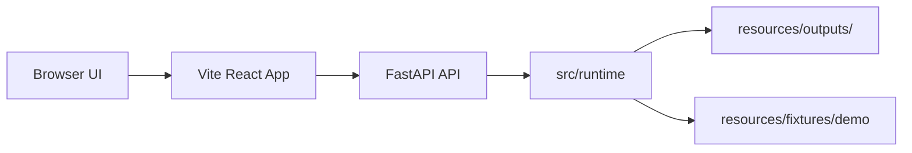

# Agent Podcast Frontend Plan

## 架构概览

本阶段采用“React/Vite 前端 + FastAPI 本地后端 + 复用现有 runtime”的结构。

前端是一个本地工程控制台，负责展示、选择、触发和浏览；后端只做薄封装，不重新实现 pipeline。后端调用 `src/runtime` 中已有的配置解析、健康检查、runner 和 artifact 读写能力，保证前端与 CLI 看到同一套 session 产物。



开发期使用 Vite dev server，`/api` 代理到 FastAPI。生产或演示打包后，由 FastAPI 挂载前端静态资源，避免只在 dev proxy 下可用。

## 核心数据结构

### FrontendSessionSummary

用于 session 列表。

| 字段 | 类型 | 说明 |
|------|------|------|
| `session_id` | string | session 名称 |
| `mode` | string | 最近一次运行模式 |
| `updated_at` | string | manifest 更新时间 |
| `stage_counts` | object | done/skipped/failed/pending 数量 |
| `has_manifest` | boolean | 是否存在 manifest |

### FrontendManifest

用于 session 详情页。

| 字段 | 类型 | 说明 |
|------|------|------|
| `session_id` | string | session 名称 |
| `mode` | string | 运行模式 |
| `started_at` | string | 开始时间 |
| `updated_at` | string | 更新时间 |
| `config_snapshot` | object | CLI/runtime 配置快照 |
| `stages` | object | 阶段状态映射 |
| `artifacts` | array | stage artifact 摘要 |
| `errors` | array | 运行错误 |

### RunRequest

用于触发 demo 或 stage。

| 字段 | 类型 | 说明 |
|------|------|------|
| `session_id` | string | 必填，目标 session |
| `force_new_session` | boolean | demo 运行时是否重置 manifest |
| `ref_chapter` | string/null | 可选参考章节路径 |
| `stage` | string/null | stage 模式下的阶段名 |

### ApiResult

所有写操作统一返回。

| 字段 | 类型 | 说明 |
|------|------|------|
| `ok` | boolean | 操作是否成功 |
| `message` | string | 给 UI 展示的摘要 |
| `data` | object/null | manifest、artifact 或 health 数据 |

### ArtifactBundle

用于产物浏览。

| 字段 | 类型 | 说明 |
|------|------|------|
| `manifest` | object/null | manifest 内容 |
| `topic` | array/null | `topic.json` |
| `director` | array/null | `director.json` |
| `script_items` | array/null | `script_items.json` |
| `script_text` | string/null | `script.txt` |
| `voice` | object/null | `voice.json` |
| `images` | array/null | `images.json` |
| `video` | object/null | `video.json` |

## 后端接口

### `GET /api/health`

返回默认 demo 配置和 full 配置的健康检查摘要。UI 用于展示 required/optional 依赖状态。

### `GET /api/sessions`

扫描 `resources/outputs`，读取存在的 manifest，返回 session 列表。没有 manifest 但目录存在时，仍返回一个 `has_manifest=false` 的摘要。

### `GET /api/sessions/{session_id}`

返回指定 session 的 manifest。不存在时返回 404 和可读错误。

### `GET /api/sessions/{session_id}/artifacts`

读取指定 session 的核心产物，统一返回 `ArtifactBundle`。缺失的产物用 `null`，不作为接口错误。

### `POST /api/runs/demo`

根据 `RunRequest` 触发 demo 运行。内部构造 `AppRunConfig` 或调用 `load_run_config` 等价参数，然后调用 `run_pipeline`。

### `POST /api/runs/stage`

根据 `RunRequest.stage` 触发单阶段重跑。第一阶段支持 `voice`、`image`、`editor`，也可允许 `topic`、`director`、`agent_speechers` 的 fixture 写出。错误以 `ApiResult.ok=false` 返回，避免浏览器只看到 traceback。

## 前端页面与组件

### App Shell

职责：整体布局、左侧 session 列表、顶部运行操作区、主体详情区。

设计重点：

- 不做营销页，打开就是工作台。
- 保持信息密度，适合课堂投屏。
- 用清楚的按钮和状态徽标表达操作结果。

### RunControls

职责：输入 session ID、触发 demo、触发 stage、刷新数据。

交互：

- demo 默认勾选 `force_new_session`。
- stage 使用下拉菜单选择 `voice/image/editor`。
- 运行中禁用按钮，显示正在运行。
- 完成后刷新 session 与 artifacts。

### HealthPanel

职责：展示 runtime health。

显示内容：

- 名称、required/optional、ok/missing、message。
- full 模式缺少 required 项时用明显但克制的错误样式。

### StageTimeline

职责：展示 v3 主线阶段状态。

阶段固定顺序：

```text
topic -> director -> agent_speechers -> voice -> image -> editor
```

`init` 和 `polish` 若出现在 manifest 中，作为 legacy/skipped 辅助项展示，不进入主线时间轴。

### ArtifactViewer

职责：浏览产物。

视图：

- Topic：表格或列表展示 topic name、core concept、zero-to-hero logic。
- Director：按 topic 展开 stages 和 bullets。
- Script：展示 `script.txt`，并可切换到结构化 `script_items`。
- Voice/Image/Video：展示 JSON 摘要。
- Manifest：展示配置快照和 artifacts 索引。

### EngineeringPanel

职责：把工程亮点转成可展示文本。

内容：

- v3 多阶段 agent 工作流。
- fixture/mock 的价值。
- stage runner 如何解决“必须从头跑”。
- manifest 如何支持复现和验收。

## 文件组织

```text
src/
  web_api/
    __init__.py
    app.py              # FastAPI app 创建、路由注册、静态文件挂载
    schemas.py          # API 请求/响应模型
    services.py         # session 扫描、artifact bundle、runtime 调用
    static.py           # 前端 dist 路径与静态服务辅助
frontend/
  package.json
  index.html
  vite.config.ts
  tsconfig.json
  src/
    main.tsx
    App.tsx
    api.ts
    types.ts
    styles.css
    components/
      RunControls.tsx
      HealthPanel.tsx
      StageTimeline.tsx
      ArtifactViewer.tsx
      EngineeringPanel.tsx
tests/
  test_web_api.py       # FastAPI API 单元/集成测试
```

## 模块设计

### `src/web_api/app.py`

**职责：** 创建 FastAPI 应用，注册 `/api/*` 路由，生产模式下挂载前端静态资源。

**接口：**

- `create_app() -> FastAPI`
- `app = create_app()`

**依赖：**

- `web_api.services`
- `web_api.schemas`

### `src/web_api/schemas.py`

**职责：** 定义 API 的请求和响应模型。

**接口：**

- `RunRequest`
- `ApiResult`
- `SessionSummary`
- `ArtifactBundle`

### `src/web_api/services.py`

**职责：** 将 HTTP 行为转换为 runtime 行为。

**接口：**

- `list_sessions(output_dir)`
- `get_manifest(session_id, output_dir)`
- `get_artifact_bundle(session_id, output_dir)`
- `run_demo(request)`
- `run_stage(request)`
- `get_health_summary()`

**依赖：**

- `runtime.run_config`
- `runtime.runner`
- `runtime.health`
- `runtime.artifacts`

### `frontend/src/api.ts`

**职责：** 封装浏览器到后端的 `fetch` 调用。

**接口：**

- `getHealth()`
- `listSessions()`
- `getSession(sessionId)`
- `getArtifacts(sessionId)`
- `runDemo(payload)`
- `runStage(payload)`

### `frontend/src/App.tsx`

**职责：** 页面级状态管理和组件组合。

**状态：**

- 当前 session
- session 列表
- health
- manifest
- artifact bundle
- loading/error/toast

## 模块交互

1. 页面启动，调用 `GET /api/health` 和 `GET /api/sessions`。
2. 用户选择 session，前端并行调用 `GET /api/sessions/{id}` 和 `GET /api/sessions/{id}/artifacts`。
3. 用户点击 Run Demo，前端调用 `POST /api/runs/demo`。
4. 后端调用 runtime，写入 `resources/outputs/<session>`。
5. 前端收到成功结果后刷新 session、manifest、artifacts。
6. 用户点击 Run Stage，流程同上，但调用 `POST /api/runs/stage`。

## 技术决策

| 决策点 | 选择 | 理由 |
|--------|------|------|
| 前端框架 | React + TypeScript | 组件化适合阶段、产物、健康检查等 UI 单元；状态需求轻量 |
| 前端工具 | Vite | 开发启动快，dev server proxy 适合本地 FastAPI；官方文档确认 proxy 仅开发期使用，因此生产由 FastAPI 挂载静态资源 |
| 后端框架 | FastAPI | 与现有 Python runtime 同语言，JSON API、路径参数、请求体验证、CORS/静态文件支持直接 |
| API 形态 | REST JSON | 本阶段无实时流式日志需求，REST 更简单稳定 |
| 运行模式 | 默认 demo/mock | 满足离线演示，不触发真实外部服务 |
| 前端状态管理 | React 本地 state + fetch 封装 | 当前页面状态简单，不引入 Redux/Zustand 等额外复杂度 |
| 样式 | 原生 CSS | 降低依赖，便于快速调整工程控制台风格 |
| 图标 | lucide-react | 按 UI 规范使用图标按钮，保持工具型界面可读性 |
| 测试 | pytest + FastAPI TestClient；前端 build 验证 | API 行为用 Python 测试，前端先以 typecheck/build 验证为主 |

## 与现有系统的关系

- CLI 保持不变，前端只是新增入口。
- `resources/outputs` 仍是唯一运行产物目录。
- `src/runtime` 是后端 API 的唯一业务来源，避免前端后端各自复制 pipeline 逻辑。
- `docs/course/runbook.md` 会增加前端启动说明。
- `requirements.txt` 会增加 FastAPI/Uvicorn/httpx 等后端依赖。
- 新增 `frontend/package.json` 管理前端依赖。

## 风险与缓解

| 风险 | 缓解 |
|------|------|
| 前端触发长任务导致请求阻塞 | 第一阶段只跑 demo/mock，耗时短；full 不做真实运行 UI |
| Vite dev proxy 与生产静态服务行为不一致 | 生产由 FastAPI 挂载 dist，前端统一使用 `/api` 相对路径 |
| session 文件缺失导致页面崩溃 | ArtifactBundle 缺失字段返回 null，前端显示空状态 |
| PowerShell 中文显示乱码误判文件坏掉 | 文档和前端文件统一 UTF-8，验证用 Python 读文件 |
| 依赖安装时间增加 | 依赖控制在 FastAPI、Uvicorn、React、Vite、lucide-react 等必要集合 |

## Spec 覆盖映射

| Spec 项 | Plan 覆盖 |
|---------|-----------|
| F1 | App Shell、SessionSummary、`GET /api/sessions` |
| F2 | RunControls、`POST /api/runs/demo` |
| F3 | HealthPanel、`GET /api/health` |
| F4 | StageTimeline、FrontendManifest |
| F5 | RunControls、`POST /api/runs/stage` |
| F6 | ArtifactViewer、ArtifactBundle |
| F7 | ApiResult、服务层错误处理 |
| F8 | EngineeringPanel |
| F9 | 文件组织、文档更新 |
| N1/N6 | demo/mock 默认和技术决策 |
| N2/N4 | 页面组件与设计重点 |
| N3/N5 | 与现有系统关系 |
| N7 | ApiResult 和错误处理 |
