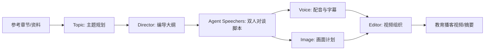

# Agent 课程大作业报告 Plan

## 写作定位

报告采用“工程实践论文”而不是“项目说明书”写法。全文围绕一个问题展开：如何将教育播客制作中高度依赖人工编导的长文本生产过程，拆解为多阶段、可检查、可扩展的 Agent 工作流。

选题编号固定为 **E：工程实践与设计**。正文开头 100 字内显式说明本文与 Agent 新技术的关系，避免老师认为偏离选题。

报告题目暂定：

> 面向教育播客生成的多阶段 Agent 工作流设计与原型实现

若需要更像论文，可选备用题目：

> 一种面向教育播客生成的多阶段 Agent 工作流设计方法

## 总体结构与字数规划

目标正文约 3500 字，不含标题、摘要、参考文献和附录。考虑软件学报模板版面，正文不宜过长，重点保持结构完整。

| 部分 | 预计字数 | 目标 |
| --- | ---: | --- |
| 摘要与关键词 | 250-350 | 交代问题、方法、结果和选题归属 |
| 选题说明与引言 | 550-650 | 前 100 字内标注 E 类；提出痛点和本文思路 |
| 需求分析与设计目标 | 450-550 | 从教育播客生产需求导出 Agent 分工 |
| 系统总体架构 | 500-650 | 写三层结构和端到端工作流 |
| 多阶段 Agent 工作流设计 | 850-1000 | 重点写 Topic、Director、Agent Speechers 与上下文机制 |
| 原型实现与案例分析 | 600-750 | 用 ch01-demo 产物说明输出形态 |
| 工程化讨论与局限 | 400-550 | 写可解释、可调试、可扩展，以及限制 |
| AI 使用说明与总结 | 300-450 | 满足作业要求并收束贡献 |

## 论文骨架

### 标题页信息

需要用户最后补全：

- 姓名
- 学号
- 院系或课程信息，如模板需要

首页标题附近显式写：

> 选题编号：E（工程实践与设计）

### 摘要

摘要采用“四句式”：

1. 背景：教育类知识播客制作需要将长篇资料转化为可听、可理解的对谈内容，人工成本高。
2. 问题：单次提示词生成长脚本容易出现结构失控、知识漂移和难以调试的问题。
3. 方法：本文提出多阶段 Agent 工作流，依次进行主题规划、编导设计、角色化对谈生成和媒体产物组织。
4. 结果与意义：原型示例表明，该结构可以保留中间产物、支持阶段检查，并为教育内容生产提供可复用的 Agent 工程实践。

摘要末尾或正文开头必须出现：

> 本文归属选题 E：工程实践与设计。

### 关键词

建议关键词：

> 大模型智能体；多智能体协作；工作流编排；教育播客；检索增强生成；媒体生成

若模板空间紧，可删去“媒体生成”。

## 正文章节设计

### 0. 选题说明与 Agent 技术关系

职责：满足作业截图中的“最开始 100 字说明与 Agent 新技术关系”。

建议写成正文第一段，放在引言前或引言开头：

> 本文选题编号为 E，属于“工程实践与设计”。本文围绕大模型 Agent 在教育内容生产中的应用，设计并分析一个面向教育播客生成的多阶段工作流原型，将资料理解、编导规划、角色化对话和媒体生成组织为可检查的 Agent 管线。

这一段不要展开项目调试历史。

### 1. 引言

核心论点：

- 知识型播客和视频不是简单朗读材料，而是需要“选题拆解、叙事组织、提问推进、通俗化解释和后期呈现”。
- 直接让大模型生成完整长脚本，会把主题规划、知识选择、角色表达和篇章节奏混在一次调用中，导致不可控。
- Agent 工程的价值在于把复杂任务拆成多个有职责边界的阶段，让每个阶段有明确输入输出。

素材来源：

- `docs/product/播客产品设计.md` 中的教育播客定位。
- `docs/dev-docs/二周目baseline重构/3.0播客内容生成管线设计.md` 中“长文本生成问题转化为多轮短文本生成问题”的思想。

避免内容：

- 不写“我之前项目很烂”“调试很重”等开发抱怨。
- 不写端口、环境、web-ui 的具体问题。

### 2. 需求分析与设计目标

核心论点：

教育播客生成系统至少需要满足四类需求：

| 需求 | 对应 Agent 设计 |
| --- | --- |
| 零基础友好 | Topic 阶段产生从浅入深的主题链 |
| 对谈自然 | Agent Speechers 采用双角色问答 |
| 内容可控 | Director 阶段显式规划每段意图和转场 |
| 可工程化生产 | 每阶段保留可检查产物，供后续媒体阶段消费 |

可引入三个制作角色：

- 知识锚点：保证内容准确和概念解释。
- 听众嘴替：提出自然问题、暴露听众困惑。
- 幕后统筹：组织节奏和转场。

映射关系：

- Topic 类似选题策划。
- Director 类似幕后编导。
- Agent Speechers 对应双主持人。
- Voice/Image/Editor 对应后期生产。

### 3. 系统总体架构

核心论点：

系统采用三层结构：

1. 知识层：章节文本、参考资料、可选 RAG 检索。
2. 内容层：Topic、Director、Agent Speechers。
3. 表现层：Voice、Image、Editor。

建议图 1：系统工作流图。

正文写法：

- 先描述数据流，不写代码路径。
- 强调每个阶段都有结构化产物。
- 把原型系统说成“可替换式模块设计”，即 LLM、TTS、图像、剪辑模块都可替换。

### 4. 多阶段 Agent 工作流设计

这是全文重点，建议分 3 个小节。

#### 4.1 Topic：从章节到递进主题

写法：

- 输入是长章节或参考资料。
- 输出是一组主题，每个主题包含名称、核心概念和 zero-to-hero 逻辑。
- 作用是把长文本组织问题前移，避免后续脚本生成阶段承担过多结构压力。

可引用案例：

- “从自然追问到人的转向”
- “苏格拉底与可对话的智能体”

#### 4.2 Director：从主题到编导计划

写法：

- Director 不直接写台词，而是规定每段讨论目的、提示素材和转场。
- 它相当于把教育播客的“幕后统筹”显式化。
- 这种设计有助于让脚本生成更稳定，也便于人工插入审核。

可引用案例：

- “问题导入”
- “Agent 协作解释”
- `intent`、`guidance`、`transition_hint` 三类字段。

#### 4.3 Agent Speechers：角色化对谈生成

写法：

- 双主持人模拟苏格拉底式问答。
- 一个角色承担提问、追问、代表听众困惑；另一个角色承担解释、归纳和过渡。
- 与单段说明文相比，对谈形式能降低理解门槛，并使知识点呈现为问题驱动的推理过程。

可引用案例脚本：

- A 提出“古希腊人为什么追问世界由什么构成？”
- B 回答并转向“人如何认识、判断和共同生活”。

#### 4.4 上下文组织机制

写法：

把上下文分成四层：

| 上下文 | 作用 | 报告表述 |
| --- | --- | --- |
| System Prompt | 固定角色、语气和任务规则 | 保证 Agent 身份稳定 |
| Current Task | 当前需要回答或抛出的问题 | 保证每轮生成聚焦 |
| Memory | 最近对话历史 | 保证上下文连贯 |
| Knowledge Base | 章节资料或检索结果 | 降低事实幻觉 |

注意：

- 不需要写具体代码。
- 可以提到滑动窗口记忆比短期对话 RAG 更适合对谈连贯性。
- RAG 只作为知识层，不把所有上下文都塞进向量检索。

### 5. 原型实现与案例分析

职责：用已有产物支撑报告，不写成使用手册。

建议表 1：阶段职责与产物。

| 阶段 | 输入 | 输出 | 作用 |
| --- | --- | --- | --- |
| Topic | 参考章节 | 主题列表 | 建立从浅入深的内容链 |
| Director | 主题列表 | 编导计划 | 规定段落意图和转场 |
| Agent Speechers | 编导计划 | 双人脚本 | 生成可播出的对谈文本 |
| Voice | 脚本 | 音频/字幕摘要 | 接入语音生成 |
| Image | 脚本/时间轴 | 画面计划 | 组织视觉素材 |
| Editor | 音频与画面 | 视频摘要/成片 | 完成媒体组合 |

案例材料：

- `resources/outputs/ch01-demo/topic.json`
- `resources/outputs/ch01-demo/director.json`
- `resources/outputs/ch01-demo/script.txt`
- `resources/outputs/ch01-demo/voice.json`
- `resources/outputs/ch01-demo/video.json`

正文逻辑：

1. 说明选取一个哲学章节作为示例输入。
2. 展示 Topic 如何产生主题。
3. 展示 Director 如何生成编导阶段。
4. 展示双人脚本如何把主题转为对谈。
5. 简要说明 Voice/Image/Editor 表明后续媒体生成接口已经被纳入管线。

不写：

- 不说 demo 是为了修测试。
- 不说 mock、端口、前端、manifest 这些过程性细节。
- 如果提到 mock，只用“原型示例中部分媒体阶段以摘要产物表示”这种学术说法。

### 6. 工程化分析与讨论

核心论点：

多阶段 Agent 工作流的价值不只在生成结果，而在工程可控性。

可写四点：

- 可解释性：中间产物让人知道系统如何从资料走到脚本。
- 可调试性：每阶段输入输出可单独检查。
- 可扩展性：模型、TTS、图像生成、剪辑模块可替换。
- 人机协同：可在 Topic 或 Director 阶段插入人工审核。

局限性：

- 真实全链路依赖 LLM、TTS、图像生成和视频工具。
- 内容质量仍依赖参考资料和提示词设计。
- 当前评估更偏案例展示，缺少大规模人工评分或自动评价指标。
- 媒体阶段质量受外部服务稳定性影响。

写法要克制：

- 把局限写成研究讨论，而不是项目自黑。
- 不写“系统打不开”“上传失败”这类工程事故。

### 7. AI 使用说明与伦理讨论

职责：满足课程明确要求“必须表明哪些部分使用了 AI 生成技术”。

建议写两层：

1. 系统层面：项目本身使用大模型参与主题拆解、编导规划和脚本生成，属于 AI 参与内容生产。
2. 报告层面：报告写作中使用 AI 辅助阅读代码、总结项目文档、生成初稿和润色，最终结构与内容由作者确认。

可补伦理点：

- 生成内容应保留人工审核。
- 知识性内容需要来源约束，避免模型幻觉。
- 应区分参考资料、模型生成文本和人工修改。

### 8. 总结

总结三点贡献：

- 提出面向教育播客生产的多阶段 Agent 工作流。
- 将长文本生成拆解为主题规划、编导计划、角色化脚本和媒体生成接口。
- 通过案例产物说明该设计具有可解释、可调试、可扩展的工程价值。

最后一句可落到选题 E：

> 因此，该实践展示了大模型 Agent 在工程化内容生产系统中的一种可行设计范式。

## 图表规划

至少放 2 个，推荐放 3 个。

### 图 1：系统总体工作流

形式：Mermaid 或 LaTeX 绘图后截图。

内容：

`参考章节 -> Topic -> Director -> Agent Speechers -> Voice/Image -> Editor -> 播客视频`

位置：第 3 节。

### 表 1：阶段职责与产物

形式：LaTeX `tabular`。

位置：第 5 节。

字段：阶段、输入、输出、作用。

### 表 2：上下文组织机制

形式：LaTeX `tabular`。

位置：第 4.4 节。

字段：上下文类型、生命周期、作用、风险控制。

如果时间不够，保留图 1 和表 1 即可。

## 证据与素材映射

| 报告论点 | 可用材料 | 使用方式 |
| --- | --- | --- |
| 项目对应工程实践与设计 | `作业相关/作业要求/1.jpg` | 首页和引言中标注 E |
| 教育播客需要角色分工 | `docs/product/播客产品设计.md` | 需求分析中改写为系统需求 |
| 长文本生成应拆成多阶段 | `3.0播客内容生成管线设计.md` | 引言和工作流设计中使用 |
| Topic 体现 zero-to-hero | `resources/outputs/ch01-demo/topic.json` | 案例分析引用主题名称 |
| Director 体现编导计划 | `resources/outputs/ch01-demo/director.json` | 案例分析引用阶段/字段 |
| 双主持人对谈 | `resources/outputs/ch01-demo/script.txt` | 选取 2-3 句短例子 |
| 媒体链路接口 | `voice.json`, `video.json` | 说明系统产物覆盖后处理阶段 |

## 参考文献组织

正式参考文献采用顺序编码制，正文第一次出现时标注 `[1]`、`[2]`。参考文献控制在 4 条左右，只服务关键论点，不堆砌工具依赖。具体候选条目见 `docs/mew-spec/report/reference-plan.md`。

正文引用安排：

- 引言：引用 ReAct，说明 Agent 不只是文本生成，还包含推理、计划和行动。
- 架构/知识层：引用 RAG，说明参考资料和检索增强对知识型内容生成的必要性。
- 多智能体对谈：引用 AutoGen，说明多个可对话 Agent 协作完成任务的思路。
- 工作流编排：引用 LangGraph 官方文档，说明状态图、长流程、持久化和人工介入能力。

不把 GPT-SoVITS、FFmpeg、Vite、FastAPI 等工程依赖写入参考文献，除非正文专门展开这些技术。项目内部文档只作为写作素材，不进入正式参考文献。

## 排版与交付策略

优先路线：

1. 先生成 Markdown 正文，便于快速修改。
2. 再迁移到 `作业相关/报告模板/latex.tex` 的结构中。
3. 使用 `rjthesis.cls` 编译 PDF。
4. 输出文件按 `学号+姓名.PDF` 命名。

若 LaTeX 编译时间不足：

1. 保持软件学报式标题、摘要、关键词和分节结构。
2. 用 Word 模板或 Markdown 转 PDF 作为应急方案。
3. 优先保证 PDF 可提交、首页信息完整、选题编号明确。

## 真实性与缺失信息处理规则

报告允许采用“课程论文式包装”，即弱化调试细节、突出设计思想和原型价值；但以下内容不得编造：

- 作者姓名、学号、学院等个人提交信息。
- 明确的实验数字、耗时、准确率、用户规模等量化结果。
- 外部论文、工具文档、官方资料的引用信息。
- 项目已经完成但实际没有任何材料支撑的功能闭环。

处理原则：

- 如果缺少个人信息，在正文或模板中保留占位符，如 `姓名`、`学号`，并在交付前提醒用户补全。
- 如果缺少真实实验数据，正文使用定性表述，如“案例产物表明”“原型验证显示”，不写具体百分比。
- 正式参考文献控制在 4 条左右，优先使用可核验来源；不能确认的引用不写入最终参考文献。
- 如果报告为了课程表达需要适度理想化系统状态，应表述为“设计目标”“原型支持”“可扩展为”，避免写成已大规模稳定验证。

## 技术决策

| 决策点 | 选择 | 理由 |
| --- | --- | --- |
| 选题编号 | E：工程实践与设计 | 与工作流、智能体框架、知识系统最匹配 |
| 报告体裁 | 工程实践型论文 | 比 README 或开发日志更符合课程报告 |
| 项目表述 | 原型系统/设计实践 | 避免过度承诺生产级稳定性 |
| 实证材料 | 使用 ch01-demo 中间产物 | 有现成可引用材料，能支撑案例分析 |
| bug 细节 | 不进入正文 | 与评分目标无关且会削弱论文观感 |
| AI 声明 | 独立小节说明 | 满足课程要求，降低学术诚信风险 |

## 待确认信息

在正式生成最终 PDF 前需要补齐：

- 作者姓名
- 学号
- 是否需要写学院/专业/课程名称
- 最终文件名

这些信息不影响下一步写正文框架，但会影响最后排版。
